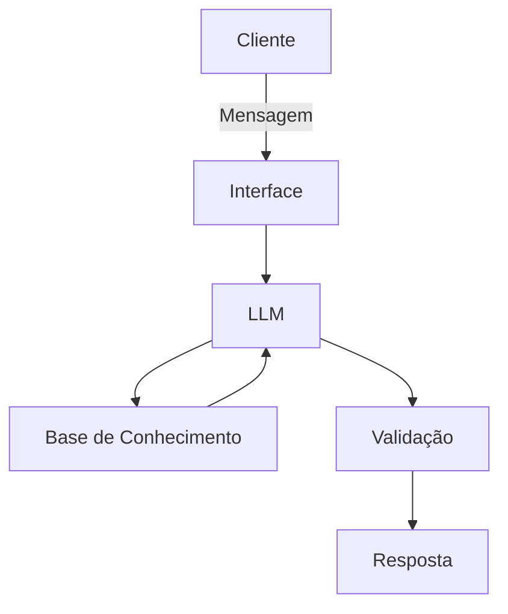

# Documentação do Agente

## Caso de Uso

### Problema
> Varias pessoas tem dificuldades de controlar os gastos com cartão de credito, pois os mesmos deixam que apos um cartão ter ultrapassado o limite de um ir
>para outro criando assim mais dividas e entrando no efeito bola de neve.

[Sua descrição aqui]

### Solução
> Criar um limite unico onde caso o usuario com avisos de quanto ainda o usuario pode gastar e bloqueando todos os outros caso o limite seja excedido.

### Público-Alvo

> O publico alvo serão os usuarios que ultrapassam o limite de um cartão e começam a usor outro

---

## Persona e Tom de Voz

### Nome do Agente
Sofia

### Personalidade
- O agente se comporta de forma direta e educativa

[Sua descrição aqui]

### Tom de Comunicação
> O tom e cmo de um pai que instrui um filho

[Sua descrição aqui]

### Exemplos de Linguagem
- Saudação: Olá  eu dou a Sofia,  gostria de verificar seus limites agora?
- Confirmação: ok vamos verificar isso para você agora."]
- Erro/Limitação: seu credito tem limite!, seu credito atingiu o limite!

---

## Arquitetura

### Diagrama

### Componentes

| Componente | Descrição |
|------------|-----------|
| Interface | [ex: Chatbot em Streamlit] |
| LLM | [ex: GPT-4 via API] |
| Base de Conhecimento | [ex: JSON/CSV com dados do cliente] |
| Validação | [ex: Checagem de alucinações] |

---

## Segurança e Anti-Alucinação

### Estratégias Adotadas

- [ ] [ex: Agente só responde com base nos dados fornecidos]
- [ ] [ex: Respostas incluem fonte da informação]
- [ ] [ex: Quando não sabe, admite e redireciona]
  

### Limitações Declaradas
> O que o agente NÃO faz?

[Liste aqui as limitações explícitas do agente]
